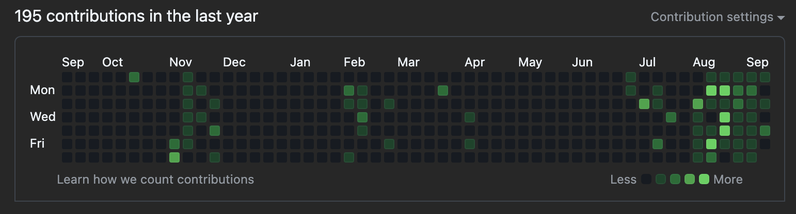
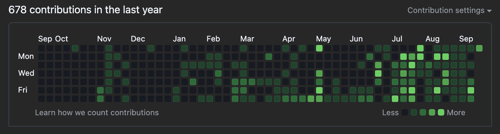

# Importing GitLab Repositories to GitHub

This guide provides two methods to migrate your GitLab repository activity to GitHub, ensuring your GitHub history reflects your work.

## Summary

This documentation outlines:
- Importing repositories from your GitLab account to GitHub.
- Migrating group projects and final projects to GitHub.

## Migrate Activity from Gitlab to Github
This is my activity on Github before and after the migration.

| Activity before mogration | Activity after migration |
| --- | --- |
|  |  |


## Prerequisites

- GitLab and GitHub accounts.
- Git installed on your system.

## Method 1: Importing Repositories from Your Own GitLab Account

1. Navigate to GitHub > Repositories > Add New.
2. Click on the "import a repository" link at the top of the first text section.
3. Insert your "Clone with https" link from your GitLab repository.
4. Fill in your GitLab credentials.
5. Name your repository (e.g., `bootcamp-week2-day2-react-intro`).
6. Set the repository to private to avoid cluttering your public repo space.
7. Click "Done" - GitHub will import the repository with all its history.

## Method 2: Migrating Group Projects and Final Projects which are not in Your GitLab Account

1. Create a private repository in GitHub (e.g., `bootcamp-group-project-frontend`).
2. Open the old project in your code editor.
3. Add the new remote:
    ```shell
    git remote add github_origin {repo https git url}
    ```
4. Push to the new remote:
    ```shell
    git push github_origin
    ```
5. Done - GitHub now contains the repository with all its history (in a new branch).

## Questions and Issues

If you have any questions or encounter any issues while following this guide, feel free to open an issue on the repository or ask your questions.

- **Open an Issue**: Navigate to the "Issues" tab of the repository and click on "New Issue" to describe your problem or question.
- **Ask a Question**: You can also ask questions directly in the repository's discussion section.

I appreciate your feedback. Feel free to reach out with any questions or suggestions.
